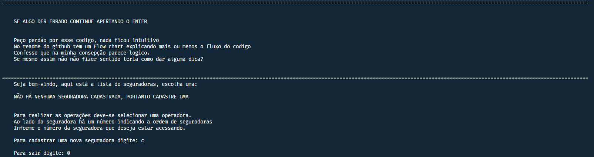
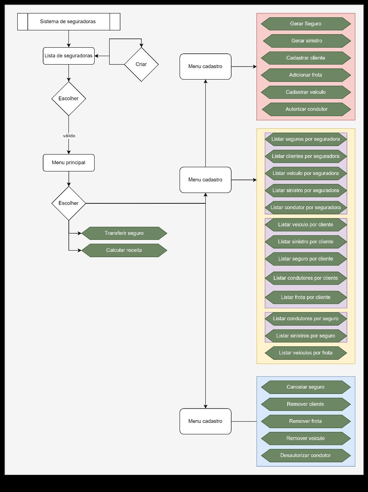

# **Programação orientada a objetos(MC322)**

# Dados
**Aluno:**
Ludivik Eduardo Silva de Paula

**RA:**
235075

**Curso:**
Engenharia de Computação

**Descrição:**
Projeto iterativo e incremental realizado ao longo do curso de Programação Orientada a Objetos(MC322) da UNICAMP, ofertado pela **Ph.D. Esther Luna Colombini**

# Gráfico de fluxo do projeto

