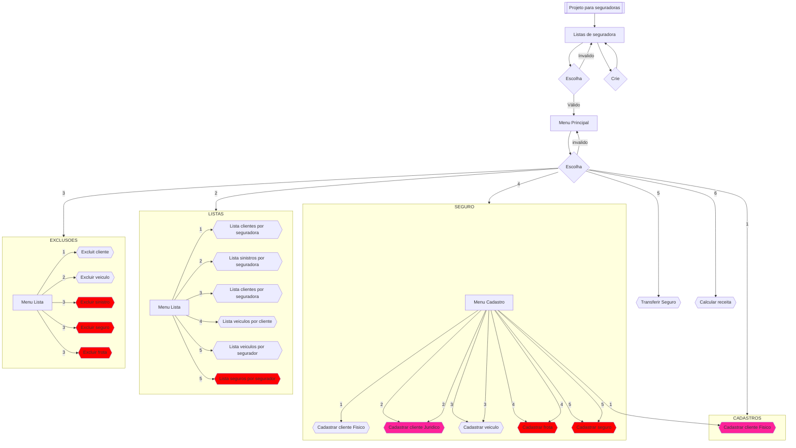

# **MC322 - Turma B**

**Aluno:**
Ludivik Eduardo Silva de Paula

**RA:**
235075

**Curso:**
Engenharia de Computação

**Descrição:**
Atividades relacionadas a disciplina MC322

# Gráfico do fluxo do projeto

